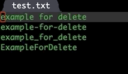

# What is delete-block?
I need an efficient plugin to delete the left and right content of the cursor.
Generally speaking, skip-syntax-forward and skip-syntax-backward can handle forward deletion and backward deletion very well.
But ```skip-syntax-*``` unable to handle camel-style word movement, such as just delete ```Foo``` part in ```FooBar``` word.

So this plugins mix `skip-syntax-*' and `subword-mode' for better delete block experience.

## Installation
Clone or download this repository (path of the folder is the `<path-to-delete-block>` used below).

In your `~/.emacs`, add the following two lines:
```Elisp
(add-to-list 'load-path "<path-to-delete-block>") ; add delete-block to your load-path
(require 'delete-block)
```

## Usage
Bind your favorite key to functions:

| Function              | Description           |
| :--------             | :----                 |
| delete-block-forward  | Delete block forward  |
| delete-block-backward | Delete block backward |
|                       |                       |
